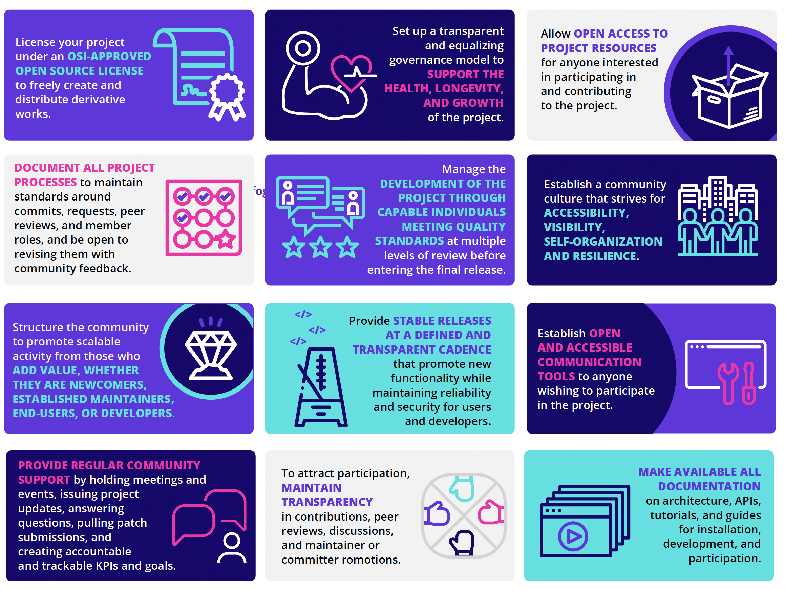

**In partnership with:**

Releasing Internal Code into a New Open Source Project:

A Guide for Stakeholders

**November 2022**

Ibrahim Haddad, Ph.D.

Executive Director, *LF AI & Data and PyTorch Foundation*

**Contents**

[Infographic 4](#document-all-project)

[Abstract 5](#abstract)

[Introduction 6](#introduction)

[Initial investigations 8](#initial-investigations)

[Make the business case to open source 8](#initial-investigations)

[Evaluate possible ways to open source 8](#initial-investigations)

[Project funding 9](#project-funding)

[Legal considerations 9](#project-funding)

[Confirm ownership of all the code 9](#project-funding)

[Conduct intellectual property review
10](#conduct-intellectual-property-review)

[Choose the open source license
10](#conduct-intellectual-property-review)

[Apply license terms to the code 11](#dco)

[Code clean-up 11](#dco)

[Project branding 12](#project-branding)

[Develop a trademark strategy and policy 12](#project-branding)

[Domain names 12](#project-branding)

[Creative assets 12](#project-branding)

[Register external accounts 12](#project-branding)

[Develop a certification/compliance strategy 12](#project-branding)

[Recruit business partners 12](#project-branding)

[Establish project governance 13](#establish-project-governance)

[Set up project infrastructure 14](#set-up-project-infrastructure)

[Apply recommended practices for your GitHub repo
14](#set-up-project-infrastructure)

[Project launch 15](#project-launch)

[Prepare the announcement 15](#project-launch)

[Press and analyst relations 15](#project-launch)

[Announce and launch the project 15](#project-launch)

[Summary of recommended practices for running an open source project
16](#summary-of-recommended-practices-for-running-an-open-source-project)

[License
16](#summary-of-recommended-practices-for-running-an-open-source-project)

[Governance
16](#summary-of-recommended-practices-for-running-an-open-source-project)

[Access
16](#summary-of-recommended-practices-for-running-an-open-source-project)

[Processes
16](#summary-of-recommended-practices-for-running-an-open-source-project)

[Development
16](#summary-of-recommended-practices-for-running-an-open-source-project)

[Community
16](#summary-of-recommended-practices-for-running-an-open-source-project)

[Community structure
16](#summary-of-recommended-practices-for-running-an-open-source-project)

[Releases 17](#_bookmark12)

[Communication tools 17](#_bookmark12)

[Transparency 17](#_bookmark12)

[Documentation 17](#_bookmark12)

[Ongoing support 18](#ongoing-support)

[Support the community 18](#ongoing-support)

[Support project infrastructure 18](#ongoing-support)

[Endnotes 18](#ongoing-support)

##### {width="3.18338801399825in" height="1.6659711286089238in"}**DOCUMENT ALL PROJECT**

###### **PROCESSES to maintain standards around commits, requests, peer reviews, and member roles, and be open to revising them with community feedback.**

### Infographics to come.

##### **Manage the DEVELOPMENT OF THE PROJECT THROUGH CAPABLE INDIVIDUALS MEETING QUALITY**

**STANDARDS at multiple levels of review before entering the final
release.**

{width="0.6569291338582677in"
height="0.22983267716535433in"}Copyright © 2022 [[The Linux
Foundation]{.underline}](https://linuxfoundation.org/) \| November
2022

This report is licensed under the [Creative Commons
Attribution-NoDerivatives 4.0 International Public
License]{.underline}

