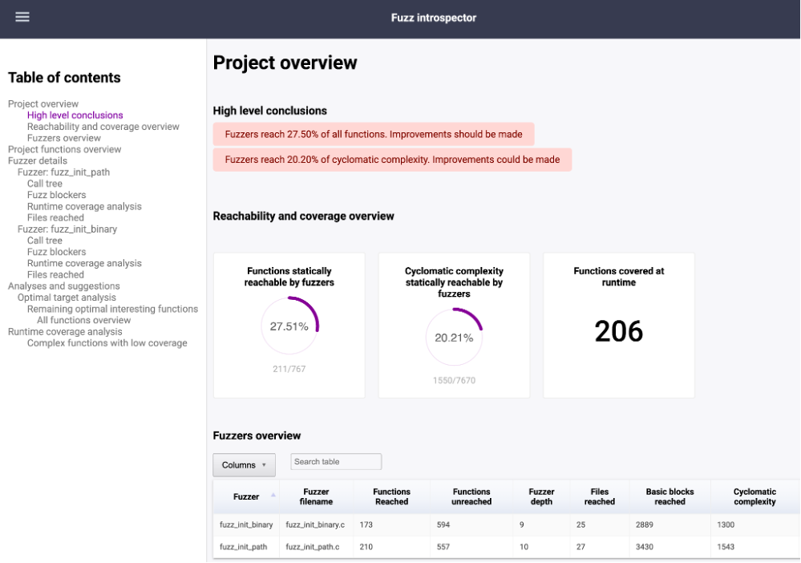

## Introducing Fuzz Introspector, an OpenSSF Tool to Improve Fuzzing Coverage
## Fuzz Introsepctor，OpenSSF 中一款用于提高模糊测试覆盖率的工具

By: Oliver Chang (Google), Navid Emamdoost (Google), Adam Korczynski (ADA Logics), and David Korczynski (ADA Logics)

作者：Oliver Chang (Google), Navid Emamdoost (Google), Adam Korczynski (ADA Logics), and David Korczynski (ADA Logics)

In recent years, many development workflows have come to rely on fuzzing, an automated technique for finding bugs by feeding unexpected inputs into software with the intent to trigger crashes or other problems. Fuzzing plays an important role in vulnerability discovery and supports one of the OpenSSF’s [main goals](https://8112310.fs1.hubspotusercontent-na1.net/hubfs/8112310/OpenSSF/White%20House%20OSS%20Mobilization%20Plan.pdf?hsCtaTracking=3b79d59d-e8d3-4c69-a67b-6b87b325313c%7C7a1a8b01-65ae-4bac-b97c-071dac09a2d8) of improving vulnerability detection and response for open source software. However, the effectiveness of fuzzing depends on how much of the code is covered by it, and writing effective tools to implement fuzzing (“fuzzers”) with good coverage is still challenging. Fuzzing today often hits coverage roadblocks (“blockers”) that prevent effective fuzzing of some code areas. Today these require manual analysis to identify and unblock, and there has been no easy or consistent way to perform this analysis. Recent notable vulnerabilities such as [BigSig](https://googleprojectzero.blogspot.com/2021/12/this-shouldnt-have-happened.html) and [NSO iMessage](https://googleprojectzero.blogspot.com/2021/12/a-deep-dive-into-nso-zero-click.html) show that there is still room for improvement in fuzzing of projects, even in projects already applying regular fuzzing.

近年来，很多开发工作流已经依赖模糊测试，这是一种通过给软件输入非期望的数据从而触发崩溃或者引起其他问题来发现缺陷的自动化技术。模糊测试在漏洞挖掘方面扮演着重要角色，同时也很好的支撑了OpenSSF的[主要目标](https://8112310.fs1.hubspotusercontent-na1.net/hubfs/8112310/OpenSSF/White%20House%20OSS%20Mobilization%20Plan.pdf?hsCtaTracking=3b79d59d-e8d3-4c69-a67b-6b87b325313c%7C7a1a8b01-65ae-4bac-b97c-071dac09a2d8)之一，即提高开源软件漏洞检测和响应。然而，模糊测试的有效性依赖于用模糊测试的方法覆盖了多少代码，并且编写能够实现高覆盖率的模糊测试（“模糊器”）依旧充满了挑战。如今的模糊测试常常遇到覆盖阻塞（“阻塞点“），这些阻塞点阻碍了对于有些代码片段的有效模糊测试。如今依旧需要手动分析来确定并进行障碍清除，且目前还没有简单或一致的方法来完成这种分析。近期值得关注的一些漏洞，诸如[SigSig](https://googleprojectzero.blogspot.com/2021/12/this-shouldnt-have-happened.html)和[NSO iMessage](https://googleprojectzero.blogspot.com/2021/12/a-deep-dive-into-nso-zero-click.html)表明了模糊测试项目还有一定的改善空间，即使这些项目已经使用了常规的模糊测试手段。

To address some of these issues, we are excited to announce an initial release of Fuzz Introspector, a collaborative effort from OpenSSF members. Fuzz Introspector provides actionable insights for developers to identify fuzzing coverage blockers by analyzing functions, static call graphs, and runtime coverage information. Resolving these blockers will help unlock improved fuzzing coverage, resulting in more vulnerability discoveries and greater confidence for users in the reliability of the code they fuzz. It can be used by two different kinds of developer: (1) developers of projects that use fuzzing (enabling them to have improved fuzzing results), and (2) developers of fuzzers (enabling all users of those fuzzers to have improved fuzzing results).

为了解决这些问题，我们很高兴的宣布首次发布[Fuzz Introspector](https://github.com/ossf/fuzz-introspector)，这是来自于OpenSSF成员的协作成果。Fuzz Introspector通过分析函数、静态调用图以及运行时覆盖率信息来为开发者提供可操作的洞察，以便识别模糊测试覆盖率的阻塞点。解决这些阻塞点将有助于解锁模糊测试覆盖率的提升，从而发现更多漏洞，并让用户对他们进行模糊测试可靠性更有信心。有两类开发者会用到这一点：（1）使用模糊测试的项目开发者（能使他们改善模糊测试结果），（2）模糊器开发者（能够让这些模糊器的所有用户改善模糊测试结果）。

Currently, Fuzz Introspector supports C/C++ projects. For each project, Fuzz Introspector provides: 

* a detailed overview of all functions in the projects, including their coverage, reachability and complexity;
* a statically extracted call-tree overview overlayed with runtime coverage information for each fuzz target along with a blocker table to pinpoint roadblocks for each fuzz target;
* a list of suggested optimal fuzz targets that can be added to increase coverage.

目前，Fuzz Introspector仅支持C/C++项目。针对每一个项目，Fuzz Introspector提供：

* 项目中所有函数的详细视图，包括函数的覆盖率、可达性和复杂性；
* 静态提取的调用树概述，覆盖每个模糊目标的运行时覆盖率信息，以及一个阻塞表，以查明每个模糊目标的阻塞点；
* 一个可以增加覆盖率的最优模糊目标建议列表。

A sample project overview for the [libdwarf](https://github.com/google/oss-fuzz/tree/master/projects/libdwarf) project

以[libdwarf](https://github.com/google/oss-fuzz/tree/master/projects/libdwarf)项目为例的项目样例概览

One early milestone for Fuzz Introspector was its recent integration into the free [OSS-Fuzz](https://github.com/google/oss-fuzz) service, with reports publicly accessible via the public index or accessible to OSS-Fuzz project maintainers via the [OSS-Fuzz project homepage](https://oss-fuzz.com/). As part of this development, we used the results of Fuzz Introspector to improve multiple OSS-Fuzz projects, including directly [addressing a gap in the xpdf project](https://github.com/ossf/fuzz-introspector/blob/main/doc/CaseStudies.md#xpdf) detailed in a [blog post](https://googleprojectzero.blogspot.com/2021/12/a-deep-dive-into-nso-zero-click.html) by Google Project Zero. You can find more examples of reports and how they were used to improve our projects [in the project](https://github.com/ossf/fuzz-introspector/blob/main/doc/CaseStudies.md) repository. 

Fuzz Introspector早期的一个里程碑是其近期与免费的[OSS-Fuzz](https://github.com/google/oss-fuzz)服务进行了集成，报告可以通过公共索引来访问，项目维护人员也可以通过[OSS-Fuzz 项目主页](https://oss-fuzz.com/)访问。作为这项开发的一部分，我们使用Fuzz Introspector的结果来改善多个OSS-Fuzz项目，包括[直接解决 xpdf 项目中的一个问题](https://github.com/ossf/fuzz-introspector/blob/main/doc/CaseStudies.md#xpdf)，详情发表在Google Project Zero的[博客](https://googleprojectzero.blogspot.com/2021/12/a-deep-dive-into-nso-zero-click.html)中。你可以在[我们的项目](https://github.com/ossf/fuzz-introspector/blob/main/doc/CaseStudies.md)发现更多的报告样例以及它们是如何被用来改善。

Fuzz Introspector is being actively developed. Some plans for the future include supporting more programming languages, improving the precision of coverage blocker identification, and guiding automated coverage exploration beyond blockers (to enable more automated elimination of blockers). We welcome community contributions toward these goals and encourage anyone interested in getting involved to take a look at the current reports, help improve fuzz targets, and provide feedback via https://github.com/ossf/fuzz-introspector. With collaborative effort, we hope that Fuzz Introspector will offer developers of fuzzers an easier way of evaluating and improving their fuzzers, making this vulnerability detection technique more effective for the wider open source community. 

Fuzz Introspector的开发很活跃。将来的一些计划包括支持更多的编程语言，改善覆盖率阻塞点识别的准确性，以及对阻塞点的自动化覆盖解释（已实现更自动化的阻塞点消除）。我们非常欢迎通过社区的贡献来达到这些目标，并鼓励任何有兴趣参与此事的人查看当前的报告，帮助改善模糊目标以及通过 https://github.com/ossf/fuzz-introspector提供更多的反馈。通过协同努力，我们希望Fuzz Introspector将能够为模糊器开发者提供一种更加简单的方式来评估和改善他们的模糊器，让这项漏洞检测技术在更广泛的开源社区中更加有效。